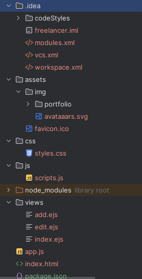
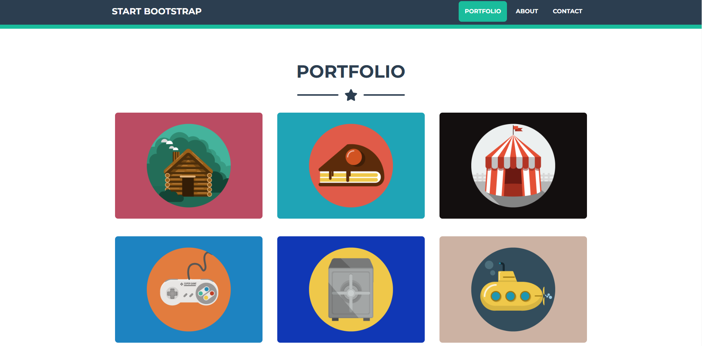

# Portfolio Project

This project is a dynamic portfolio website where you can manage your projects with **CRUD operations** (Create, Read, Update, Delete). It utilizes **EJS** for templating and **Express.js** for the backend.

---

## Features
- **Dynamic project listing**
- **Add new projects**
- **Edit existing projects**
- **Delete projects**
- Uses Bootstrap for styling

---

## How to Run

1. Clone the repository:
   ```bash
   git clone https://github.com/your-repo/portfolio-project.git
   ```
2. Navigate to the project directory:
   ```bash
   cd portfolio-project
   ```
3. Install dependencies:
   ```bash
   npm install
   ```
4. Start the server:
   ```bash
   node app.js
   ```
5. Open your browser and visit:
   ```
   http://localhost:3000
   ```

---

## Screenshots

### 1. Project Folder Structure


### 2. Add Project Page


---


## Technologies Used

- **Node.js**: Backend server.
- **Express.js**: Web framework.
- **EJS**: Templating engine.
- **Bootstrap**: Frontend framework.

---

## License
This project is licensed under the MIT License. See the LICENSE file for details.
